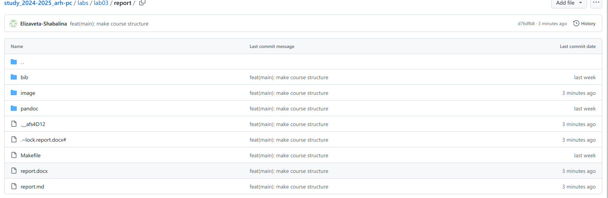

---
## Front matter
title: "ЛАБОРАТОРНАЯ РАБОТА № 3"
subtitle: "Дисциплина: архитектура компьютера"
author: "Шабалина Елизавета Андреевна"

## Generic otions
lang: ru-RU
toc-title: "Содержание"

## Bibliography
bibliography: bib/cite.bib
csl: pandoc/csl/gost-r-7-0-5-2008-numeric.csl

## Pdf output format
toc: true # Table of contents
toc-depth: 2
lof: true # List of figures
lot: true # List of tables
fontsize: 12pt
linestretch: 1.5
papersize: a4
documentclass: scrreprt
## I18n polyglossia
polyglossia-lang:
  name: russian
  options:
	- spelling=modern
	- babelshorthands=true
polyglossia-otherlangs:
  name: english
## I18n babel
babel-lang: russian
babel-otherlangs: english
## Fonts
mainfont: IBM Plex Serif
romanfont: IBM Plex Serif
sansfont: IBM Plex Sans
monofont: IBM Plex Mono
mathfont: STIX Two Math
mainfontoptions: Ligatures=Common,Ligatures=TeX,Scale=0.94
romanfontoptions: Ligatures=Common,Ligatures=TeX,Scale=0.94
sansfontoptions: Ligatures=Common,Ligatures=TeX,Scale=MatchLowercase,Scale=0.94
monofontoptions: Scale=MatchLowercase,Scale=0.94,FakeStretch=0.9
mathfontoptions:
## Biblatex
biblatex: true
biblio-style: "gost-numeric"
biblatexoptions:
  - parentracker=true
  - backend=biber
  - hyperref=auto
  - language=auto
  - autolang=other*
  - citestyle=gost-numeric
## Pandoc-crossref LaTeX customization
figureTitle: "Рис."
tableTitle: "Таблица"
listingTitle: "Листинг"
lofTitle: "Список иллюстраций"
lotTitle: "Список таблиц"
lolTitle: "Листинги"
## Misc options
indent: true
header-includes:
  - \usepackage{indentfirst}
  - \usepackage{float} # keep figures where there are in the text
  - \floatplacement{figure}{H} # keep figures where there are in the text
---

# Цель работы

Целью работы является освоение процедуры оформления отчетов с помощью легковесного
языка разметки Markdown.

# Задание

    1. Установка необходимого ПО
    2. Заполнение отчета по выполнению лабораторной работы №4 с помощью языка разметки Markdown
    3. Задание для самостоятельной работы
    

# Теоретическое введение

Markdown - легковесный язык разметки, созданный с целью обозначения форматирования в простом тексте, с максимальным сохранением его читаемости человеком, и пригодный для машинного преобразования в языки для продвинутых публикаций. 
Внутритекстовые формулы делаются аналогично формулам LaTeX.
В Markdown вставить изображение в документ можно с помощью непосредственного указания адреса изображения.
Синтаксис Markdown для встроенной ссылки состоит из части [link text], представляющей текст гиперссылки, и части (file-name.md) – URL-адреса или имени файла, на который дается ссылка.
Markdown поддерживает как встраивание фрагментов кода в предложение, так и их размещение между предложениями в виде отдельных огражденных блоков. Огражденные блоки кода — это простой способ выделить синтаксис для фрагментов кода.

# Выполнение лабораторной работы

1.1) Откроем терминал и перейдём в каталог курса сформированный при выполнении лабораторной работы №2 (рис. [-@fig:001])

{#fig:001 width=70%}

1.2) Обновляю локальный репозиторий, скачав изменения из удаленного репозитория с помо-
щью команды get pull. Затем переходим в каталог с шаблоном отчета по лабораторной работе № 3 и выполняем команду make(рис. [-@fig:002])

{#fig:002 width=70%}

1.3)При успешной компиляции должны были сгенерироваться файлы report.pdf и report.docx., но у меня появился только report.docx (рис. [-@fig:003])

{#fig:003 width=70%}

1.4) Удаляем полученный файлы с использованием Makefile. Для этого введём команду
make clean и проверяем, что после этой команды файлы report.pdf и report.docx были удалены (рис. [-@fig:004])

{#fig:004 width=70%}

1.5) Откроем файл report.md c помощью gedit (рис. [-@fig:005])

{#fig:005 width=70%}

1.6) Заполняю отчет и компилирую отчет с использованием Makefile. (рис. [-@fig:006])

{#fig:006 width=70%}

1.7) Загружаю файлы на Github (рис. [-@fig:007])

{#fig:007 width=70%}

# Задание для самостоятельной работы

# Выводы

В результате выполнения данной лабораторной работы я освоила процедуры оформления отчетов с помощью легковесного языка разметки Markdown.

# Список литературы{.unnumbered}

    1. [Архитектура ЭВМ](https://esystem.rudn.ru/pluginfile.php/1584625/mod_resource/content/1/%D0%9B%D0%B0%D0%B1%D0%BE%D1%80%D0%B0%D1%82%D0%BE%D1%80%D0%BD%D0%B0%D1%8F%20%D1%80%D0%B0%D0%B1%D0%BE%D1%82%D0%B0%20%E2%84%964.pdf)
:::
