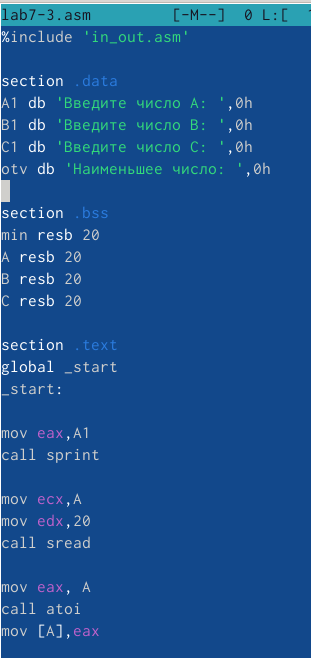
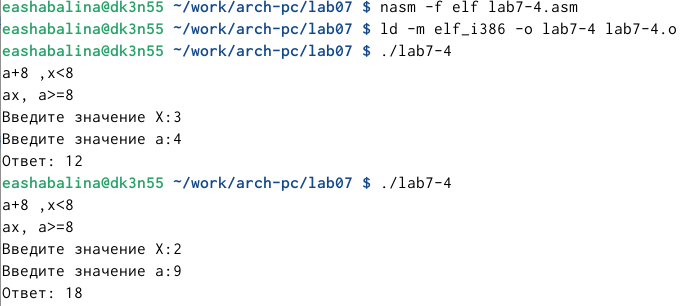

---
## Front matter
title: "Отчет по лабораторной работе №7"
subtitle: "Дисциплина: архитектура компьютера"
author: "Шабалина Елизавета Андреевна"

## Generic otions
lang: ru-RU
toc-title: "Содержание"

## Bibliography
bibliography: bib/cite.bib
csl: pandoc/csl/gost-r-7-0-5-2008-numeric.csl

## Pdf output format
toc: true # Table of contents
toc-depth: 2
lof: true # List of figures
fontsize: 12pt
linestretch: 1.5
papersize: a4
documentclass: scrreprt
## I18n polyglossia
polyglossia-lang:
  name: russian
  options:
	- spelling=modern
	- babelshorthands=true
polyglossia-otherlangs:
  name: english
## I18n babel
babel-lang: russian
babel-otherlangs: english
## Fonts
mainfont: PT Serif
romanfont: PT Serif
sansfont: PT Sans
monofont: PT Mono
mainfontoptions: Ligatures=TeX
romanfontoptions: Ligatures=TeX
sansfontoptions: Ligatures=TeX,Scale=MatchLowercase
monofontoptions: Scale=MatchLowercase,Scale=0.9
## Biblatex
biblatex: true
biblio-style: "gost-numeric"
biblatexoptions:
  - parentracker=true
  - backend=biber
  - hyperref=auto
  - language=auto
  - autolang=other*
  - citestyle=gost-numeric
## Pandoc-crossref LaTeX customization
figureTitle: "Рис."
listingTitle: "Листинг"
lofTitle: "Список иллюстраций"
lolTitle: "Листинги"
## Misc options
indent: true
header-includes:
  - \usepackage{indentfirst}
  - \usepackage{float} # keep figures where there are in the text
  - \floatplacement{figure}{H} # keep figures where there are in the text
---

# Цель работы

Изучение команд условного и безусловного переходов. Приобретение навыков написания программ с использованием переходов. Знакомство с назначением и структурой файла листинга.

# Выполнение лабораторной работы

## Реализация переходов в NASM

1) Я создала каталог lab07 и внутри создала файл lab7-1.asm (рис. [-@fig:001]).

{ #fig:001 width=70% }

2) Я ввела в файл текст программы и запустила его (рис. [-@fig:002]).

{ #fig:002 width=70% }

3) Я создала исполняемый файл и запустила его. Результат соответствовал нужному (рис. [-@fig:003]).

{ #fig:003 width=70% }

4)Я изменила текст программы чтобы выводился нужный ответ (рис. [-@fig:004]) и создала исполняемый файл (рис. [-@fig:005]).

{ #fig:004 width=70% }

{ #fig:005 width=70% }

5)Я изменила текст программы чтобы сначала выводило сообщение 3,затем 2, затем 1 (рис. [-@fig:006]).

{ #fig:006 width=70% }

6) Запустила программу и проверила ее работу (рис. [-@fig:007]).

{ #fig:007 width=70% }

## Изучение структуры файлы листинга

7) Я создала файл lab7-2.asm и написала текст программы (рис. [-@fig:008]).

{ #fig:008 width=70% }

8) Я ввела два разных числа, чтобы проверить как работает программа (рис. [-@fig:009]). 

{ #fig:09 width=70% }

9) Я создала файл листинга lab7-2.lst и открыла его (рис. [-@fig:010]).

{ #fig:010 width=70% }

10) Проанализировав файл, я поняла как он работает и какие значения выводит.

Эта строка находится на 24 месте, ее адрес "00000101", Машинный код - В8 [0A000000], а mov eax,B - исходный текст программы, означающий что в регистр eax мы вносим значения переменной B (рис. [-@fig:011]).

{ #fig:011 width=70% }

Эта строка находится на 38 месте, ее адрес "00000134", Машинный код - E863FFFFFF, а call atoi - исходный текст программы, означающий что символ лежащий в строке выше переводится в число (рис. [-@fig:012]).

{ #fig:012 width=70% }

Эта строка находится на 50 месте, ее адрес "00000162", Машинный код - A1[00000000], а mov eax,[max] - исходный текст программы, означающий что число хранившееся в переменной max записывается в регистр eax (рис. [-@fig:013]).

{ #fig:013 width=70% }

11) В строке mov eax,max я убрала max и попробовала создать файл. Выдало ошибку, так как для программы нужно два операнда (рис. [-@fig:014]).

{ #fig:014 width=70% }

12) В файле листинга показывает, где именно ошибка и с чем она связана (рис. [-@fig:015]).

{ #fig:015 width=70% }

## Самостоятельная работа.

1) Я написала программу для нахождения меньшего из трех чисел (рис. [-@fig:016]). Для большего удобства я сделала ввод чисел с клавиатуры.У меня 17-й вариант поэтому числа были :26,12,68. Программа вывела меньшее из этих чисел (рис. [-@fig:017]).

{ #fig:016 width=70% }

{ #fig:017 width=70% }

2) Я написала программу, чтобы она вычисляла выражение при введенных Х и А (рис. [-@fig:018]). Для большего удобства, выражение которое будет вычисляться я вывожу вначале работы программы. Так как у меня 17-ый вариант, то программа написана для 17-го варианта (рис. [-@fig:019]).

{ #fig:018 width=70% }

{ #fig:019 width=70% }

# Вывод

Я изучил команды условного и безусловного перехода. Приобрел навыки написания программ с переходами.

::: {#refs}
:::
